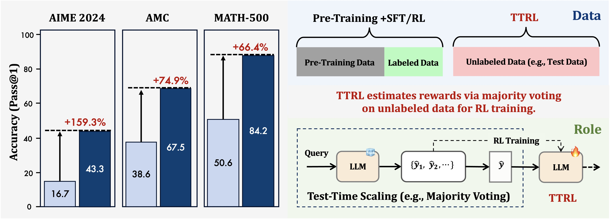
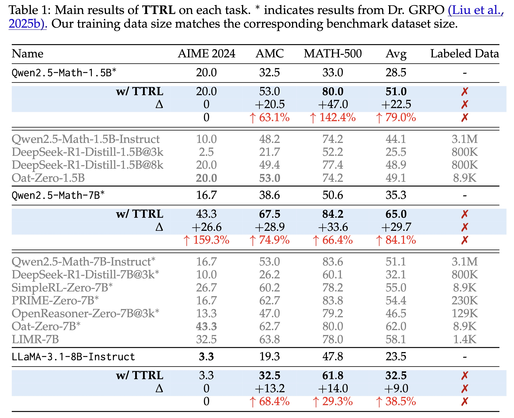

<div align="center">

# TTRL: Test-Time Reinforcement Learning

[](https://arxiv.org/abs/2504.16084)  [](https://github.com/PRIME-RL/TTRL)
[](https://wandb.ai/truman-yx-zuo-nlp/TTRL/workspace?nw=nwusertrumanyxzuo)


<div align="center" style="font-family: Arial, sans-serif;">
  <p>
    <a href="#news" style="text-decoration: none; font-weight: bold;">🎉 News</a> •
    <a href="#introduction" style="text-decoration: none; font-weight: bold;">📖 Introduction</a> •
    <a href="#evaluation" style="text-decoration: none; font-weight: bold;">📃 Evaluation</a>
  </p>
  <p>
    <a href="#getting-started" style="text-decoration: none; font-weight: bold;">✨ Getting Started</a> •
    <a href="#contact" style="text-decoration: none; font-weight: bold;">📨 Contact</a> •
    <a href="#citation" style="text-decoration: none; font-weight: bold;">🎈 Citation</a>
  </p>
</div>

</div>

# 🎉News

- **[2025-04-24]** We release training code and experimental logs for TTRL. Check it out: [Getting Started](#getting-started)

- **[2025-04-23]** We present **TTRL** (Test-Time Reinforcement Learning), an open-source solution for online RL on data without ground-truth labels, especially test data.

# 📖Introduction

We investigate Reinforcement Learning (RL) on data without explicit labels for reasoning tasks in Large Language Models (LLMs). 
The core challenge of the problem is reward estimation during inference while not having access to ground-truth information.
While this setting appears elusive, we find that common practices in Test-Time Scaling (TTS), such as majority voting, yield surprisingly effective rewards suitable for driving RL training.

<p align="center">
   
</p>


<p align="center">
   
</p>


# 📃Evaluation
<details>
<summary>
  Evaluation Details
</summary>
Our experiments demonstrate that TTRL consistently improves performance across a variety of tasks and models.
Notably, TTRL boosts the pass@1 performance of Qwen-2.5-Math-7B by approximately 159% on the AIME 2024 with only unlabeled test data.

Furthermore, although TTRL is only supervised by the Maj@N metric, TTRL has demonstrated performance to consistently surpass the upper limit of the initial model, and approach the performance of models trained directly on test data with ground-truth labels.

<p align="center">
   
</p>

</details>

# ✨Getting Started

AIME 2024 exhibits a certain degree of instability. To ensure the validity and reproducibility of our results, we additionally conducted three independent runs using this preview version of the code. Two of the runs achieved a pass@1 of 43.3, while one run reached 46.7. For detailed metrics, please refer to the [Weights & Biases logs](https://wandb.ai/truman-yx-zuo-nlp/TTRL/workspace).

You can reproduce the results of Qwen2.5-Math-7B on AIME 2024 with the following commands:

```bash
git clone git@github.com:PRIME-RL/TTRL.git
cd code

pip install -r requirements.txt
pip install -e .

bash scripts/ttrl_aime_grpo_7b.sh ttrl_dir qwen_model_dir wandb_key
```

The implementation of TTRL can be achieved rapidly by simply modifying the reward function. Please refer to the following code snippet for details:

<p align="center">
   
</p>

The current code is a preview version developed internally based on [OpenRLHF](https://github.com/OpenRLHF/OpenRLHF), and we will continue to optimize it and officially launch it soon.
Meanwhile, TTRL will also be integrated into the official [OpenRLHF](https://github.com/OpenRLHF/OpenRLHF)&[verl](https://github.com/volcengine/verl) code.

*All experiments were conducted on 8 * NVIDIA A100 40GB GPUs.*

# 📨Contact

- Kaiyan Zhang: zhang-ky22@mails.tsinghua.edu.cn

- Ning Ding: dn97@mail.tsinghua.edu.cn

# 🎈Citation
If you find TTRL helpful, please cite us.

```bibtex
@article{zuo2025ttrl,
  title={TTRL: Test-Time Reinforcement Learning},
  author={Zuo, Yuxin and Zhang, Kaiyan and Qu, Shang and Sheng, Li and Zhu, Xuekai and Qi, Biqing and Sun, Youbang and Cui, Ganqu and Ding, Ning and Zhou, Bowen},
  journal={arXiv preprint arXiv:2504.16084},
  year={2025}
}
```

# ⭐️Star History

[](https://www.star-history.com/#PRIME-RL/TTRL&Date)
